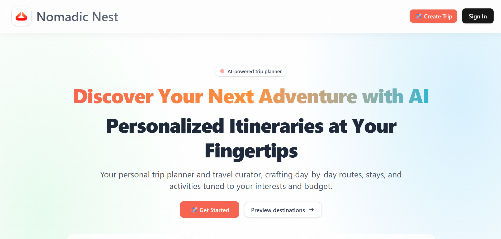
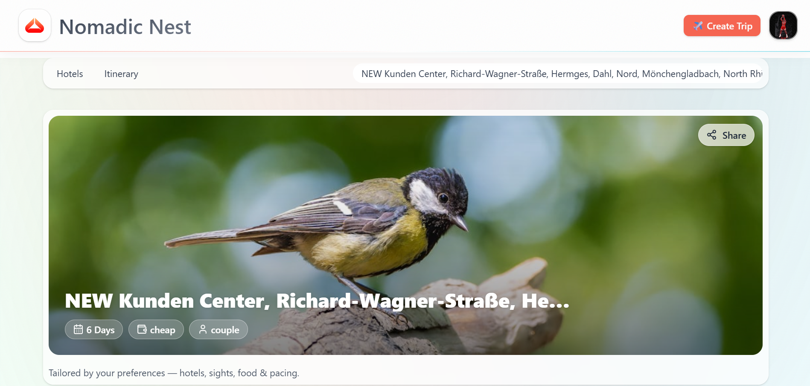
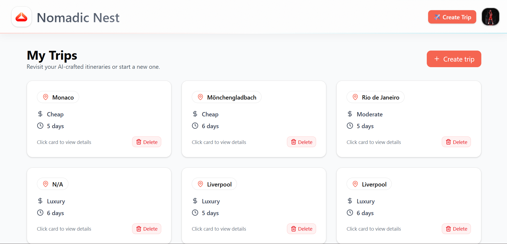
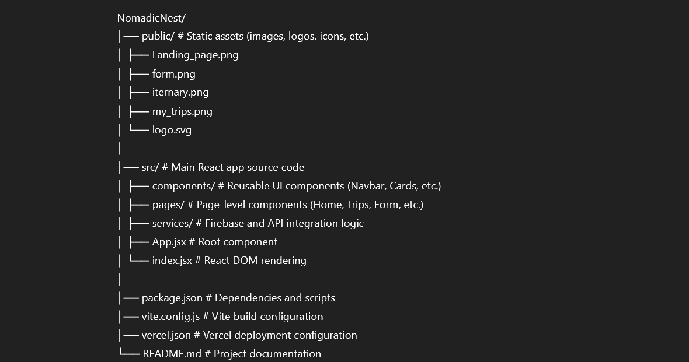

# 🏕️ NomadicNest  

> **React.js · Firebase · Google Gemini Pro · Google Places API · Unsplash API**

NomadicNest is an **AI-powered travel planning web application** designed to simplify trip planning.  
It combines **real-time APIs** and **AI itinerary generation** with a sleek, responsive UI to help users create and manage their dream trips.  

---

## ✨ Features  

- 🔑 **Secure Authentication**  
  - Google OAuth via Firebase for quick and safe login.  
  - User-specific sessions and real-time sync with Firestore.  

- 🗂 **Itinerary Management**  
  - AI-generated itineraries tailored to user preferences (using **Gemini Pro**).  
  - Saved in Firestore so users can revisit anytime.  

- 🌍 **Smart Destination Search**  
  - Powered by **Google Places API** for accurate destination data.  
  - Auto-suggestions for cities, landmarks, and attractions.  

- 🖼 **Visual Exploration**  
  - Integrated **Unsplash API** provides beautiful, high-resolution travel photos.  
  - Enhances the user experience and makes the app engaging.  

- 🎨 **Modern & Responsive UI**  
  - Built with **React.js, TailwindCSS, and ShadCN/UI**.  
  - Works smoothly on desktop, tablet, and mobile devices.  

- ⚡ **Deployed on Vercel**  
  - Instant global access with CI/CD.  

---

## 🖼 Screenshots  

### 🏠 Landing Page  
  

### 🔑 Preference Form  
  

### 📑 Itinerary Generator  
  

### 🗺 My Trips Dashboard  
  

---

## 📂 File Structure  

Below is an overview of the core folders and files:

  

